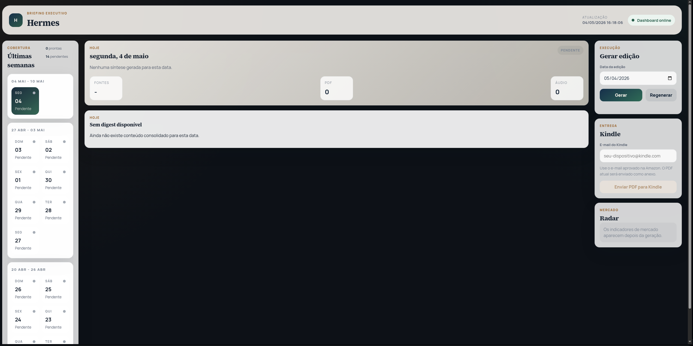

<!-- PROJECT SHIELDS -->
[![Contributors][contributors-shield]][contributors-url]
[![Forks][forks-shield]][forks-url]
[![Stargazers][stars-shield]][stars-url]
[![Issues][issues-shield]][issues-url]
[![Unlicense License][license-shield]][license-url]
[![LinkedIn][linkedin-shield]][linkedin-url]

<!-- PROJECT LOGO -->
<br />
<div align="center">
  <a href="https://github.com/alissonpef/Newsletter-Curator">
    
  </a>

  <h3 align="center">Hermes Newsletter Curator (v3)</h3>

  <p align="center">
    Um pipeline minimalista e eficiente para curadoria de newsletters financeiras com IA.
    <br />
    <a href="https://github.com/alissonpef/Newsletter-Curator"><strong>Explorar código »</strong></a>
    <br />
    <br />
    <a href="https://github.com/alissonpef/Newsletter-Curator/issues">Reportar Bug</a>
    &middot;
    <a href="https://github.com/alissonpef/Newsletter-Curator/issues">Sugerir Funcionalidade</a>
  </p>
</div>

<!-- TABLE OF CONTENTS -->
<details>
  <summary>Sumário</summary>
  <ol>
    <li>
      <a href="#📋-sobre-o-projeto">Sobre o Projeto</a>
      <ul>
        <li><a href="#funcionalidades-principais">Funcionalidades Principais</a></li>
      </ul>
    </li>
    <li>
      <a href="#🚀-como-começar">Como Começar</a>
      <ul>
        <li><a href="#pré-requisitos">Pré-requisitos</a></li>
        <li><a href="#instalação">Instalação</a></li>
      </ul>
    </li>
    <li><a href="#🛠️-uso">Uso</a></li>
    <li><a href="#🤝-contribuindo">Contribuindo</a></li>
    <li><a href="#📧-contato">Contato</a></li>
  </ol>
</details>

---

## 📋 Sobre o Projeto

O **Hermes v3** é a versão reconstruída do curador de newsletters focado no "básico bem feito". O sistema atua como um editor humano: lê seus e-mails, sintetiza um único texto contínuo e gera um PDF limpo e um Podcast agradável de ouvir.

### Funcionalidades Principais:
- **Ingestão IMAP:** Monitoramento e extração limpa das newsletters.
- **Síntese de Passe Único (LLM):** Uso do Ollama para ler as notícias e redigir um "Resumo Executivo" coeso, sem repetições.
- **PDF Minimalista:** Relatórios simplificados gerados com **Typst** contendo o Radar de Mercado e o resumo.
- **Podcast TTS:** Conversão do resumo em áudio para audição diária.
- **Dashboard Web:** Interface limpa para visualizar, baixar e reproduzir as sínteses.

---

## 🚀 Como Começar

### Pré-requisitos
- **Python 3.10+**
- **Ollama** (com modelo `qwen2.5:7b` ou equivalente instalado localmente)
- **Typst** (instalado no sistema para compilação de PDF)

### Instalação

1. Clone o repositório:
   ```sh
   git clone https://github.com/alissonpef/Newsletter-Curator.git
   ```
2. Instale as dependências:
   ```sh
   pip install -r requirements.txt
   ```
3. Configure o arquivo `.env`:
   ```env
   IMAP_HOST=imap.gmail.com
   IMAP_USERNAME=seu_email@gmail.com
   IMAP_PASSWORD=sua_senha_app
   OLLAMA_CHAT_MODEL=qwen2.5:7b
   ```

---

## 🛠️ Uso

*(Consulte o PRD para detalhes da arquitetura em reconstrução)*

### Rodar o Dashboard Web
```sh
python -m hermes.main serve-web
```
Acesse em: `http://127.0.0.1:8787`

---

## 🤝 Contribuindo

Contribuições são bem-vindas para manter a versão v3 limpa e direta.

1. Fork o projeto
2. Crie sua Feature Branch (`git checkout -b feature/AmazingFeature`)
3. Commit suas mudanças (`git commit -m 'Add some AmazingFeature'`)
4. Push para a Branch (`git push origin feature/AmazingFeature`)
5. Abra um Pull Request

---

## 📧 Contato

**Alisson Pereira Ferreira**  
LinkedIn: [https://www.linkedin.com/in/alisson-pereira-ferreira/](https://www.linkedin.com/in/alisson-pereira-ferreira/)  
E-mail: [alissonpef@gmail.com](mailto:alissonpef@gmail.com)  

Link do Projeto: [https://github.com/alissonpef/Newsletter-Curator](https://github.com/alissonpef/Newsletter-Curator)

---

<p align="right">(<a href="#readme-top">voltar ao topo</a>)</p>

<!-- MARKDOWN LINKS & IMAGES -->
[contributors-shield]: https://img.shields.io/github/contributors/alissonpef/Newsletter-Curator.svg?style=for-the-badge
[contributors-url]: https://github.com/alissonpef/Newsletter-Curator/graphs/contributors
[forks-shield]: https://img.shields.io/github/forks/alissonpef/Newsletter-Curator.svg?style=for-the-badge
[forks-url]: https://github.com/alissonpef/Newsletter-Curator/network/members
[stars-shield]: https://img.shields.io/github/stars/alissonpef/Newsletter-Curator.svg?style=for-the-badge
[stars-url]: https://github.com/alissonpef/Newsletter-Curator/stargazers
[issues-shield]: https://img.shields.io/github/issues/alissonpef/Newsletter-Curator.svg?style=for-the-badge
[issues-url]: https://github.com/alissonpef/Newsletter-Curator/issues
[license-shield]: https://img.shields.io/github/license/alissonpef/Newsletter-Curator.svg?style=for-the-badge
[license-url]: https://github.com/alissonpef/Newsletter-Curator/blob/master/LICENSE.txt
[linkedin-shield]: https://img.shields.io/badge/-LinkedIn-black.svg?style=for-the-badge&logo=linkedin&colorB=555
[linkedin-url]: https://www.linkedin.com/in/alisson-pereira-ferreira/